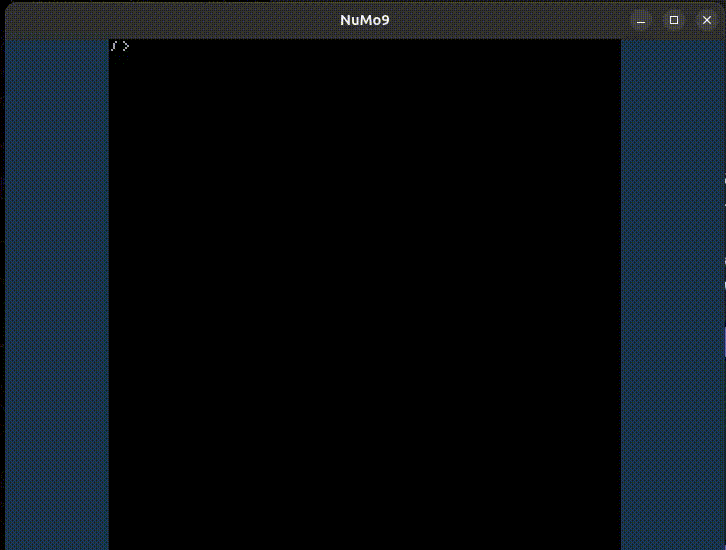

[](https://buy.stripe.com/00gbJZ0OdcNs9zi288)<br>
[](https://buymeacoffee.com/thenumbernine)<br>


[Bank! Available on Steam. Purchases help support development!](https://store.steampowered.com/app/3844040/Bank/?beta=0)<br>
[](https://store.steampowered.com/app/3844040/Bank/?beta=0)

[Youtube Playlist:](https://www.youtube.com/watch?v=R8FA24Iwo6w&list=PLvkQx1ZpORprcwfSuMEvSgGO7Kpxo44Ma)<br>
[](https://www.youtube.com/watch?v=R8FA24Iwo6w&list=PLvkQx1ZpORprcwfSuMEvSgGO7Kpxo44Ma)

[Discord Channel](https://discord.gg/5mRZPNHccB)

# Fantasy Console

I thought I'd make a fantasy console with all the LuaJIT binding code and libraries I have laying around.

What does NuMo9 have that the competition doesn't?
- 16-bit console era.  4-button gamepads.
- 8bpp sprites, 8x8 or 16x16 tilemaps, brushmaps, blending.
- "Mode-7" transformations, "Super-FX" 3D meshes and ***VOXELMAPS***.
- ***HD2D!***  Free SSAO and lightmaps for all your 3D games.
- Multiplayer, 4 local players per connection, up to 64 total players, unlimited observers.
- Server can edit games in realtime.  Live game DM'ing.
- It's strictly LuaJIT.  No compiler needed.
- Pico8-compatible.  TIC-80 so-so.

# "Hardware"

<a name='framebuffer'></a>
### Framebuffer

|Mode| Resolution | Format    | Ratio |
|----|------------|-----------|-------|
|  0 | 256x256    | RGB565    |  1:1  |
|  1 | 256x256    | 8bppIndex |  1:1  |
|  2 | 256x256    | RGB332    |  1:1  |
|  3 | 272x217    | RGB565    |  5:4  |
|  4 | 272x217    | 8bppIndex |  5:4  |
|  5 | 272x217    | RGB332    |  5:4  |
|  6 | 288x216    | RGB565    |  4:3  |
|  7 | 288x216    | 8bppIndex |  4:3  |
|  8 | 288x216    | RGB332    |  4:3  |
|  9 | 304x202    | RGB565    |  3:2  |
| 10 | 304x202    | 8bppIndex |  3:2  |
| 11 | 304x202    | RGB332    |  3:2  |
| 12 | 320x200    | RGB565    |  8:5  |
| 13 | 320x200    | 8bppIndex |  8:5  |
| 14 | 320x200    | RGB332    |  8:5  |
| 15 | 320x192    | RGB565    |  5:3  |
| 16 | 320x192    | 8bppIndex |  5:3  |
| 17 | 320x192    | RGB332    |  5:3  |
| 18 | 336x189    | RGB565    |  16:9 |
| 19 | 336x189    | 8bppIndex |  16:9 |
| 20 | 336x189    | RGB332    |  16:9 |
| 21 | 336x177    | RGB565    |  17:9 |
| 22 | 336x177    | 8bppIndex |  17:9 |
| 23 | 336x177    | RGB332    |  17:9 |
| 24 | 352x176    | RGB565    |  2:1  |
| 25 | 352x176    | 8bppIndex |  2:1  |
| 26 | 352x176    | RGB332    |  2:1  |
| 27 | 384x164    | RGB565    |  21:9 |
| 28 | 384x164    | 8bppIndex |  21:9 |
| 29 | 384x164    | RGB332    |  21:9 |
| 30 | 352x352    | 8bppIndex |  1:1  |
| 31 | 352x352    | RGB332    |  1:1  |
| 32 | 400x320    | 8bppIndex |  5:4  |
| 33 | 400x320    | RGB332    |  5:4  |
| 34 | 416x312    | 8bppIndex |  4:3  |
| 35 | 416x312    | RGB332    |  4:3  |
| 36 | 432x288    | 8bppIndex |  3:2  |
| 37 | 432x288    | RGB332    |  3:2  |
| 38 | 448x280    | 8bppIndex |  8:5  |
| 39 | 448x280    | RGB332    |  8:5  |
| 40 | 464x278    | 8bppIndex |  5:3  |
| 41 | 464x278    | RGB332    |  5:3  |
| 42 | 480x270    | 8bppIndex |  16:9 |
| 43 | 480x270    | RGB332    |  16:9 |
| 44 | 496x262    | 8bppIndex |  17:9 |
| 45 | 496x262    | RGB332    |  17:9 |
| 46 | 512x256    | 8bppIndex |  2:1  |
| 47 | 512x256    | RGB332    |  2:1  |
| 48 | 544x233    | 8bppIndex |  21:9 |
| 49 | 544x233    | RGB332    |  21:9 |

Only format RGB565 supports blending effects.

8bppIndex mode is mainly for compatability for other fantasy consoles of changing palettes post-framebuffer-write.
Fun fact, in real life 80s/90s consoles didn't have framebuffers, so after-the-fact palette editing is indeed a fantasy.

RGB332 uses dithering when converting from the 5551 palette entries.  It could support blending in OpenGL4 (via `GL_R3_G3_B2`) but there's no support for this in GLES3/WebGL, too bad.  I could do blending myself with ping-pong framebuffer operations but ... so much work for such a little reward ....

I've included a free/hidden depth buffer (like TIC-80 does), so you get free z-sorting.  It clears upon `cls()`.

## Blobs

Carts are formed by a collection of binary blobs.

Blobs can be of the types: `sheet, tilemap, palette, font, sfx, music, code, data, persist, brushmap, mesh3d, voxelmap, animsheet`.

When archiving, multiple blobs of any type can be added to the cart via the archiver by adding an index after the filename.  If the first is `sheet.png` then subsequent would be `sheet1.png`, `sheet2.png`, etc.  Indexing must be sequential, the archiver will stop if there is a skip in the numbers.

Archiver filenames per blobs as as follows:

| blob type | filename      | unarchived file format description           |
|-----------|---------------|----------------------------------------------|
| sheet     | sheet.png     | 256 x 256 x 8bpp-indexed                     |
| tilemap   | tilemap.png   | 256 x 256 x rgb 8bpp (only 16bpp used)       |
| font      | font.png      | 256 x 4 x 1bpp-indexed                       |
| sfx       | sfx.wav       | 32khz int16 mono                             |
| music     | music.bin     | 16bpp delta-compresesd custom tracker format |
| code      | code.lua      | code                                         |
| data      | data.bin      | binary blob                                  |
| persist   | persist.bin   | binary blob                                  |
| brushmap  | brushmap.bin  | custom format                                |
| mesh3d    | mesh3d.obj    | wavefront .obj                               |
| voxelmap  | voxelmap.vox  | custom format                                |
| animsheet | animsheet.png | 1024 x 1 x rgb 8bpp (only 16bpp used)        |

## Blob Types:

### sheet

Sheet blobs are used for sprite-sheets and tilemap-sheets.
Tiles are 8x8 pixels.
Tile BPP can be anywhere from 1bpp to 8bpp, colors indexed into a palette.
The renderer can draw the sprite bits starting at any bitplane.
This way you can store (and edit) 8 1-bpp images in the same texture region.

The sheet is 256x256 pixels.  This means 32x32 instances of 8x8 tiles are in a sheet.  Tiles are indexed 0 through 1023.
The renderer also accepts an optional color index to consider transparent in addition to the palette alpha flag.
The renderer also accepts a palette offset used for drawing low-bpp images using various palettes.

### palette

The palette is a set of 256 colors stored in 5551 RGBA format.
Alpha is opacity, except when drawing solid rectangle/circle/line.

### font

The font is stored in a 256x8 texture.
Each 8x8 tile holds 8 characters in 1bpp, one per bitplane.

### tilemap

The tilemap is 256x256x16bpp.
Tilemap bits:
- 10: lookup of the tile index in the sheet.
- 3: palette offset high 3 bits
- 3: 2D orientation

2D orientations are represented as follows:
- 1 bit: hflip / mirror
- 2 bits: rotation in 90 degrees

If you want to h-flip, use 0b001.
If you want to v-flip, h-flip and rotate twice, so use 0b101.

Tilemaps can render 8x8 or 16x16 sprites.  This can be specified in the `tilemap()` or `drawbrush()` functions.

The tilemap editor can make use of autotiling if the `numo9_autotile` global is defined.
`numo9_autotile` should point to a table of functions.
Functions accept `(x,y)` and will write to the tile and its neighbors using `mget/mset` or `peekw/pokew` .

### code

This holds a copy of the code in RAM.  Idk why.  if you poke it, nothing happens. Maybe I'll change that in the future but idk why I would, other than "for lulz".

### data

Any binary blob

### persist

Any binary blob that will be saved in the save config folder under the cart's metainfo `saveid`, or MD5 if none is provided.

### brushmap

Brushmaps are a collection of stamps of specified x,y,width,height, and orientation.
Stamps are associated with a specific brush.
Stamps are stored in memory in the following structure:
```
typedef struct {
	uint16_t brush : 13;
	uint16_t orientation : 3;
	uint16_t x, y, w, h;
} Stamp;
```

Brushes are currently defined as a table in the `numo9_brushes` global in code.
`numo9_brushes` keys are indexes corresponding with the brush index.
Values are functions that produce tileIndexes that can be blitted to the tilemap with the `blitbrush` and `blitbrushmap` functions.
Values have the signature: `tileIndex = brush(relx, rely, stampw, stamph, stampx, stampy)`

### mesh3d

3D meshes are stored in memory in the following format:
```
uint16_t numVertexes, numIndexes;
struct {
	int16_t x, y, z;
	int8_t u, v;
} vertexes;
uint16_t indexes[numIndexes];
```

The x,y,z coordinates are treated as integers.  If you want to scale down your meshes then you must make use of the Mode-7 transforms.

The u,v texcoords are lookups into the sprite sheet that the mesh is rendered with.

If no indexes are provided then the renderer assumes indexes are sequential spanning all vertexes.

When using the `n9a.lua` tool to save and load mesh3d blobs, meshes are imported and exported as Alias Wavefront `.obj` format.
Both texcoords and vertexes are offset by 0.5 and scaled down by 1/256.  This way texcoords are normalized and models are in a reasonable scale, for the sake of previewing in other 3D model viewers.

### voxelmap

```
typedef struct {
	uint32_t tileXOffset : 5;		// selector to offset texcoords in the sprite sheet, so the same mesh3d can be drawn with different textures.
	uint32_t tileYOffset : 5;
	uint32_t mesh3DIndex : 16;	// up to 65536 unique voxel block types
	uint32_t orientation : 6;	// 6 bits needed to represent all possible 48 isometric orientations of a cube.
} Voxel;
```

```
uint32_t width, height, depth;
Voxel voxels[depth][height][width];
```

The `mesh3DIndex` is the index into `mesh3d` blob list of what to render.
Typically mesh3d's are drawn with signed int16 xyz coordinates and rely on you to rescale size accordingly.
For voxel maps, meshes are remapped such that the coordinates [-16384, 16384] map to \[0, 1\] (i.e. divide by 32768, then add 0.5).

The 3D orientations, like the 2D orientations, can be decomposed into bitfields:
- 2 bits = yaw / Z-axis rotation
- 2 bits = pitch / Y-axis rotation
- 1 bit = roll / X-axis rotation
- 1 bit = mirror

The following 3D orientation representations are redundant, and will be used for special-case orientations.
- #20 (Rz=0,Ry=1,Rx=1,Sx=0) is equal to #7 (Rz=3,Ry=1,Rx=0,Sx=0), so I will instead use this for voxel-centered xyz-aligned billboard orientation.
- #21 (Rz=1,Ry=1,Rx=1,Sx=0) is equal to #4 (Rz=0,Ry=1,Rx=0,Sx=0). so I will instead use this for voxel-centered xy-aligned billboard orientation.
- #22 (Rz=2,Ry=1,Rx=1,Sx=0) is equal to #5 (Rz=1,Ry=1,Rx=0,Sx=0).
- #23 (Rz=3,Ry=1,Rx=1,Sx=0) is equal to #6 (Rz=2,Ry=1,Rx=0,Sx=0).
- #28 (Rz=0,Ry=3,Rx=1,Sx=0) is equal to #13 (Rz=1,Ry=3,Rx=0,Sx=0).
- #29 (Rz=1,Ry=3,Rx=1,Sx=0) is equal to #14 (Rz=2,Ry=3,Rx=0,Sx=0).
- #30 (Rz=2,Ry=3,Rx=1,Sx=0) is equal to #15 (Rz=3,Ry=3,Rx=0,Sx=0).
- #31 (Rz=3,Ry=3,Rx=1,Sx=0) is equal to #12 (Rz=0,Ry=3,Rx=0,Sx=0).

- #52 (Rz=0,Ry=1,Rx=1,Sx=1) is equal to #32 (Rz=3,Ry=1,Rx=0,Sx=1).
- #53 (Rz=1,Ry=1,Rx=1,Sx=1) is equal to #29 (Rz=0,Ry=1,Rx=0,Sx=1).
- #54 (Rz=2,Ry=1,Rx=1,Sx=1) is equal to #30 (Rz=1,Ry=1,Rx=0,Sx=1).
- #55 (Rz=3,Ry=1,Rx=1,Sx=1) is equal to #31 (Rz=2,Ry=1,Rx=0,Sx=1).
- #60 (Rz=0,Ry=3,Rx=1,Sx=1) is equal to #38 (Rz=1,Ry=3,Rx=0,Sx=1).
- #61 (Rz=1,Ry=3,Rx=1,Sx=1) is equal to #39 (Rz=2,Ry=3,Rx=0,Sx=1).
- #62 (Rz=2,Ry=3,Rx=1,Sx=1) is equal to #40 (Rz=3,Ry=3,Rx=0,Sx=1).
- #63 (Rz=3,Ry=3,Rx=1,Sx=1) is equal to #37 (Rz=0,Ry=3,Rx=0,Sx=1).

The editor voxelmap controls:
- left-click and drag to place blocks.
- right-click to delete block.
- shift+left-click to use the dropper.
- ctrl+left-click-and-drag to rotate.
- alt+left-click-and-drag to zoom.
- ctrl+alt+left-click-and-drag to pan the camera.

Voxelmap mesh generation is currently stored in chunks, however the voxel data itself is still in one giant `[z][y][x]` blob in RAM.

### sfx and music

(note to self, split this between sfx & music blob format and the APU specs)

I might undercut SNES quality when it comes to audio.
Not only am I not much of a retro audio programmer, but the SNES happened to be an exceptional audio hardware console of its time.

256 Sound samples at once.
Each sample is 16bit mono.

256 different music tracks.
Music is stored in a custom format:
```
uint16_t beatsPerSecond;
struct {
	uint16_t delayUntilNextNoteInBeats;

	//Array of byte offset and value changes to the `channels` array in RAM at the current beat.
	//An offset and value of 0XFF indicates the end of the list.
	//An offset of 0xFE means that the next value will specify the music track to immediately jump to.
	struct {
		uint8_t offset;
		uint8_t value;
	}[];
}[];
```
When playing music track `i`, the music data starts at `musicAddrs[i].addr` and ends at `musicAddrs[i].addr + musicAddrs[i].len`.

Each mixing channel holds the following information:
- volume[2] for left and right output
- echoVolume[2] TODO
- pitch frequency scalar, where 0x1000 pitch corresponds to 1:1 playback
- sfxID 0-255 corresponding with what sfx sample to play;
- echoStartAddr TODO
- echoDelay TODO
There are 8 mixing channels.

In this sense, if you are used to other fantasy consoles, their waveforms becomes my samples and their sfx and music (tracker format audio) become my music.

### animsheet

This is a 1024 x 16bpp mapping used for animation.
It is initialized to identity, i.e. `animsheet[i] = i`.
When rendering `tilemap()`, the tile index is looked up in this table.
You can use this table for performing animations like so:

```
local animSheetAddr = ramaddr'animsheet'
pokew(animSheetAddr + (oldTileIndex << 1), newTileIndex)
```

When rendering `tilemap()` with `tilemapIndexOffset`, the offset is applied before the animsheet table is used.

## Mode7

What's a SNES-era fantasy-console without mode7?
There are a few matrix functions that you can use to manipulate the render state:
`matident`, `mattrans`, `matrot`, `matscale`, `matlookat`, `matortho`, `matfrustum`.

## HD2D

There's one master switch.
You have to set `useHardwareLighting` to nonzero to turn on lighting effects.
It is currently a bitflag:
- 1 = apply lighting to surface.  disable for solid-color.
- 2 = cast shadows on other geometry
- 4 = use SSAO
- 8 = use bump-mapping, calculated from deviation in tile colors converted to greyscale.  disable to use solid surface normals.
- 0x10 = occlude based on lightmap / realtime shadows.
- 0x20 = perform lightmap, ambient, diffuse, specular lighting calculations

There are some SSAO variables in RAM.  Tweak to your heart's content.  `ssaoSampleRadius` is in world coordinates.

There's lights/lightmaps variables in RAM too.  You can peek the uber-lightmap size,
and you can poke to set the number of lightmaps and their properties (like where in the uber-lightmap the light subregion goes).
I have a big enough one enabled by default, but of course world coordinates vary per game so you'll probably have to tweak it. 

Don't change your view or projection matrix between illuminated render calls!
The first scene render view and projection matrix at the time that `useHardwareLighting` is set will be recorded.  This will be used for lighting in the final calculation pass.

Illuminated polys are flagged in the fragment color buffer, so any tris drawn with useHardwareLighting=0 won't be illumianted (but they will still cast shadows, haha).

Here is the current light struct in the RAM `lights` table:
```
Light:
0x00 - 0x01 = uint8_t enabled
- & 1 = update the light's depth texture.
- & 2 = use this light in surface color calculations.
0x02 - 0x0a = uint16_t[4] region in the lightmap
0x0a - 0x0e = uint8_t[4] ambientColor.  only RGB used.
0x0e - 0x12 = uint8_t[4] diffuseColor.  only RGB used.
0x12 - 0x16 = uint8_t[4] specularColor.  RGB is the color, 4th component is the specular intensity (unnormalized)
0x18 - 0x24 = float[3] distAtten.  [0] = constant, [1] = linear, [2] = quadratic, calculated in world space coordinates.
0x24 - 0x64 = float[16] viewMat
0x64 - 0xa4 = float[16] projMat
```

You must set the RAM variable `numLights` to the number of lights you want the fantasy console to consider.
Then, among those in the `lights`, array you must set each light's `enabled` to 1.
This way the fantasy console "lighting hardware" only needs to iterate over a minimum necessary number of lights,
while still allowing you to turn lights on or off by toggling their `enabled` field without repositioning them in the array every time they are used.

It will change soon I'm sure.  Angle attenutation TODO.  I'll probably get rid of ambient. I'll convert everything to floats for shader-struct support.

Depth of field is half implemented and broken.  It needs an extra framebuffer pass when enabled.  I haven't added this yet.

HDR coming soon.

## Memory Layout

```
RAM size: 0x2d0d2
ROM size: 0x3123c
memory layout:
- RAM -
0x000000 - 0x020000 = framebuffer
0x020000 - 0x020008 = clipRect
0x020008 - 0x020048 = modelMat
0x020048 - 0x020088 = viewMat
0x020088 - 0x0200c8 = projMat
0x0200c8 - 0x0200c9 = videoMode
0x0200c9 - 0x0200cb = screenWidth
0x0200cb - 0x0200cd = screenHeight
0x0200cd - 0x0200ce = blendMode
0x0200ce - 0x0200d0 = blendColor
0x0200d0 - 0x0200d2 = dither
0x0200d2 - 0x0200d3 = cullFace
0x0200d3 - 0x0200d4 = paletteBlobIndex
0x0200d4 - 0x0200d5 = fontBlobIndex
0x0200d5 - 0x0200d6 = animSheetBlobIndex
0x0200d6 - 0x0201d6 = fontWidth
0x0201d6 - 0x0201d7 = textFgColor
0x0201d7 - 0x0201d8 = textBgColor
0x0201d8 - 0x0201dc = framebufferAddr
0x0201dc - 0x0201e0 = spriteSheetAddr
0x0201e0 - 0x0201e4 = spriteSheet1Addr
0x0201e4 - 0x0201e8 = tilemapAddr
0x0201e8 - 0x0201ec = paletteAddr
0x0201ec - 0x0201f0 = fontAddr
0x0201f0 - 0x020270 = channels
0x020270 - 0x020350 = musicPlaying
0x020350 - 0x020354 = updateCounter
0x020354 - 0x020358 = romUpdateCounter
0x020358 - 0x0203a1 = keyPressFlags
0x0203a1 - 0x0203ea = lastKeyPressFlags
0x0203ea - 0x02087a = keyHoldCounter
0x02087a - 0x02087e = mousePos
0x02087e - 0x020882 = mouseWheel
0x020882 - 0x020886 = lastMousePos
0x020886 - 0x02088a = lastMousePressPos
0x02088a - 0x02088c = useHardwareLighting
0x02088c - 0x02088e = lightmapWidth
0x02088e - 0x020890 = lightmapHeight
0x020890 - 0x02089c = lightAmbientColor
0x02089c - 0x02089e = numLights
0x02089e - 0x02d09e = lights
0x02d09e - 0x02d0aa = depthOfFieldPos
0x02d0aa - 0x02d0b6 = depthOfFieldAtten
0x02d0b6 - 0x02d0ba = ssaoSampleRadius
0x02d0ba - 0x02d0be = ssaoInfluence
0x02d0be - 0x02d0c2 = spriteNormalExhaggeration
0x02d0c2 - 0x02d0c6 = blobCount
0x02d0c6 - 0x02d0d2 = blobEntries
```

# Language

It uses Lua as the underlying script.
Cartridge code can make use of my [langfix](https://github.com/thenumbernine/langfix-lua) language modifications.
This adds to Lua(/JIT):
- bit operators: `& | << >> >>>`
- integer-division: `a // b`
- in-place operators: `..= += -= *= /= //= %= ^= &= |= ~~= <<= >>= >>>=`
- lambdas: `[args] do stmts end` for functions, `[args] expr` for single-expression functions.
- safe-navigation: `a?.b, a?['b'], a?(), a?.b(), a?:b(), a.b?(), a?.b?(), a:b?(), a?:b?()`
- ternary operator: `a ? b : c`, null-coalescence: `a ?? b`.

# API

## Callbacks

If the following functions are defined then they will be called from the virtual-console:

- `update()` - This is called 60 times every second.  You can call draw routines here if you would like and they should be sent out to all connected clients.

- `draw(connID, connPlayer1, connPlayer2, connPlayer3, connPlayer4)` - This is called 60 times every second per-client that is connected.
	- `connID` = a unique string for this connection.
	- `connPlayer#` = the index number (0-63) of the 4 players present on this connection.

- `onconnect(connID)` - This is called when a ROM is initialized or when a new client connects to a server listening.

## virtual-filesystem commands:

- `ls()` = list directory
- `dir()` = same
- `cd()` = change directory
- `mkdir()` = make directory

## system:

- `print(...)` = print to screen
- `trace(...)` = print to host OS terminal

- `run()` = run loaded cartridge.
- `stop()` = stop all execution and drop into console mode.
- `cont()` = continue execution of the cartridge.

- `save([filename])` = save cartridge to virtual-filesystem and host-filesystem.
- `open([filename])` = open cartridge.
- `reset()` = reload cartridge to its initial state.
- `quit()` = quit the entire application outright to host OS.

- `time()` = soon to be cartridge run time, currently poor mans implementation

- `#include <code-to-insert>` = Ok reluctantly I'm adding an `#include` preprocessor.  It is only applied upon `n9a.lua` archiving carts, if you extract the cartridge then you will see the code already inserted. I'll replace it with multi-file storage and a proper `require` someday.

## memory

- `peek(addr)` = read 1 byte from memory.
- `peekw(addr)` = read 2 bytes from memory.
- `peekl(addr)` = read 4 bytes from memory.
- `peekf(addr)` = read 4 bytes from memory as float.
- `poke(addr, value)` = write 1 byte to memory.
- `pokew(addr, value)` = write 2 bytes to memory.
- `pokel(addr, value)` = write 4 bytes to memory.
- `pokef(addr, value)` = write 4 bytes to memory as float.
- `memcpy(dst, src, len)` = copy from `src` to `dst`, sized `len`.
- `memset(dst, val, len)` = set memory in `dst` to uint8 value `val`, size in bytes `len`.  OOB ranges will copy a value of 0.
- `strcpy(src, len)` = copies RAM into a Lua string and returns it.
- `pget(x, y)` = returns the color/value at this particular x, y in the framebuffer, either a 16bit or 8bit value depending on the video mode.
- `pset(x, y, c)` = sets the color/value at this particular x, y in the framebuffer , either a 16bit or 8bit value depending on the video mode.
- `ramaddr(name)` = returns the address of the RAM variable.  This is because I don't want to expose all of the `ffi` table to the cart, so this is just `ffi.offsetof('RAM', field)`.  See the RAM structure for individual field names.
- `ramsize(name)` = returns the size the RAM variable.  This is because I don't want to expose all of the `ffi` table to the cart, so this is just `ffi.sizeof('RAM', field)`.  See the RAM structure for individual field names.
- `numblobs(name)` = returns the count of blobs of type `name`. Index is 0-based.
- `blobaddr(name, index)` = returns the address of the `index`'th blob of type `name`. Index is 0-based.  Blob type names can be found in the #Blobs section
- `blobsize(name, index)` = returns the size of the `index`'th blob of type `name`. Index is 0-based.
- `int8_t, uint8_t, int8_t, int16_t, uint16_t, int16_t, int32_t, uint32_t, int32_t` = If you want to cast stuff, use these `ffi.typeof`'s.  Notice, these currently return `cdata` so in some cases you must still `tonumber()` them.

While Pico8 has the `reload` and `cstore` functions for copying to/from RAM to ROM, and Tic80 has the `sync` function for doing similar, I am tempting myself with the idea of just using a different address range.
But how to do this in conjunction with multiple banks, a feature that Tic80 also has, especially multiple VRAM banks.  I do like the idea of having multiple VRAM banks accessible with `spr` and `map` functions.

## graphics

- `yield()` = flip the framebuffer, aka yield the game coroutine, and wait until the next 60Hz frame to begin.  `yield` is identical to `coroutine.yield`.
- `cls([colorIndex], [depthOnly])` = Clears the screen to the palette index at `color`.
- `fillp([pattern])` = Sets the 16-bit 4x4 dither pattern, where 0 is fully solid and 0xffff is fully transparent.  Default is 0.  Bit values follow a Bayer dither matrix.
- `pal(i, [value])` = If value is not provided then returns the uint16 RGBA 5551 value of the palette entry at index `i`.  If value is provided then the palette entry at `i` is set to the value.
- `rect(x, y, w, h, [colorIndex])` = draw solid rectangle
- `rectb(x, y, w, h, [colorIndex])` = draw rectangle border
- `elli(x, y, w, h, [colorIndex])` = draw a solid filled ellipse.  If you want to draw a circle then you have use an ellipse.
- `ellib(x, y, w, h, [colorIndex])` = draw a ellipse border.
- `tri(x1, y1, x2, y2, x3, y3, [colorIndex])` = draw a solid triangle.
- `tri3d(x1, y1, z1, x2, y2, z2, x3, y3, z3, [colorIndex])` = draw a solid triangle.
	- (x1,y1,z1), (x2,y2,z2), (x3,y3,z3) = triangle coordinates
- `ttri3d(x1, y1, z1, u1, v1, x2, y2, z2, u2, v2, x3, y3, z3, u3, v3, [sheetIndex=0, paletteOffset=0, transparentIndex=-1, spriteBit=0, spriteMask=0xFF])` = draw a triangle textured with a sprite/tile sheet.
	- x1,y1,z1,x2,y2,z2,x3,y3,z3 = triangle coordinates
	- u1,v1,u2,v2,u3,v3 = texture coordinates, in texels.
	- sheetIndex = sheet to use, default 0.
	- paletteOffset = same as `spr()`.
	- transparentIndex = same as `spr()`.
	- spriteBit = same as `spr()`.
	- spriteMask = same as `spr()`.
- `line(x1, y1, x2, y2, [colorIndex, thickness])` = draw line.
- `line3d(x1, y1, z1, x2, y2, z2, [colorIndex, thickness])` = draw line but with z / perspective.
- `spr(spriteIndex, [screenX, screenY, tilesWide, tilesHigh, orientation2D, scaleX, scaleY, paletteOffset, transparentIndex, spriteBit, spriteMask])` = draw sprite
	- spriteIndex = which sprite to draw.
		- Bits 0..4 = x coordinate into the 32x32 grid of 8x8 tiles in the 256x256 sprite/tile sheet.
		- Bits 5..9 = y coordinate " " "
		- Bit 10..15 = which sheet blob to use (up to 64 addressable at present).
			Sheet 0's sprite sheet address is relocatable with the `spriteSheetAddr` , and sheet 1's is relocatable with the `spriteSheet1Addr`.
	- screenX, screenY = pixel location of upper-left corner of the sprite.  Default is 0,0.
	- tilesWide, tilesHigh = the size of the sprite in the spritesheet to draw, in 8x8 tile units.  Default is 1x1.
	- orientation2D = 0-7, 2D orientation values, same as in tilemap high bits.
	- scaleX, scaleY = on-screen scaling.
	- paletteOffset = a value to offset the colors by.  This can be used for providing high nibbles and picking a separate palette when drawing lower-bpp sprites.
	- transparentIndex = an optional color to specify as transparent.  default is -1 to disable this.
	- spriteBit = which bitplane to draw.  default is start at bitplane 0.
	- spriteMask = mask of which bits to use.  default is 0xFF, in binary 1111:1111, which uses all 8 bitplanes.
		- the resulting color index drawn is `(incomingTexelIndex >> spriteBit) & spriteMask + paletteOffset`
- `quad(screenX, screenY, w, h, tx, ty, tw, th, [sheetIndex, orientation2D, paletteOffset, transparentIndex, spriteBit, spriteMask])` = draw arbitrary section of the spritesheet.  Cheat and pretend the PPU has no underlying sprite tile decoding constraints.  Equivalent of `sspr()` on pico8.
	- screenX, screneY = pixel location of upper-left corner of the sprite-sheet to draw
	- w, h = pixels wide and high to draw.
	- tx, ty = sprite sheet pixel upper left corner.
	- tw, th = sprite sheet width and height to use.
	- orientation2D = same as `spr()`, default 0.
	- sheetIndex = sheet index, default 0.
	- paletteOffset = same as `spr()`.
	- transparentIndex = same as `spr()`.
	- spriteBit = same as `spr()`.
	- spriteMask = same as `spr()`.
- `tilemap(tileX, tileY, tilesWide, tilesHigh, screenX, screenY, [tilemapIndexOffset, draw16x16Sprites, sheetIndex, tilemapIndex])` = draw the tilemap.
	- tilesWide, tilesHigh = size of the map, in tiles, default to 1x1.
	- screenX, screenY = where to draw the map, default to 0,0.
	- tilemapIndexOffset = global offset to shift all tilemap index values (the 10-bit lookup into the sheet only, excluding the palette and orientation bits), default to 0.
	- draw16x16Sprites = the tilemap draws 16x16 sprites instead of 8x8 sprites, default to false.
	- sheetIndex = the sheet to use, default to 0.
	- tilemapIndex = the tilemap blob index to use, default to 0.
	- I am really tempted to swap out `tileX, tileY` with just tileIndex, since that's what `mget` returns and what the tilemap stores.  I know pico8 and tic80 expect you to split up the bits every time you call this, but I don't see the reason...
- `mget(x, y, [tilemapIndex=0])` = Read the uint16 from the tilemap address at x, y.
	Out of bounds coordinates return a value of 0.
	Bank 0's tilemap is relocatable using the address stored at `tilemapAddr`.
- `mset(x, y, value, [tilemapIndex=0])` = Write a uint16 to the current tilemap address at x, y.
- `drawbrush(brushIndex, screenX, screenY, tilesWide, tilesHigh, [orientation2D, draw16x16Sprites, sheetBlobIndex])` = draw the brush `brushIndex` at screen location `sx, sy` with tile size `w, h`.  You can specify 'orientation' to flip / rotate the stamp.  You can clip the stamp to the tile range `cx, cy, cw, ch`.
- `blitbrush(brushIndex, tilemapIndex, x, y, w, h, [orientation2D, cx, cy, cw, ch])` = stamp the brush `brushIndex` onto the tilemap `tilemapIndex` at location `x, y` with size `w, h`.  You can specify 'orientation' to flip / rotate the stamp.  You can clip the stamp to the tile range `cx, cy, cw, ch`.
- `blitbrushmap(brushmapIndex, tilemapIndex, [x, y, cx, cy, cw, ch])` = blit the brushmap `brushmapIndex` onto the tilemap `tilemapIndex` at location `x, y` (defaults to 0,0), clipping to the rect `cx, cy, cw, ch` within the brushmap (default, use full brushmap size).
- `mesh(mesh3DIndex, [uofs, vofs, sheetIndex, paletteOffset, transparentIndex, spriteBit, spriteMask])` = draw the specified mesh3d blob.
	- uofs, vofs = an amount to offset u and v coordinates (which wrap), defaults to 0.
	- sheetIndex = defaults to 0.
	- The rest of the parameters are forwarded to `ttri3d()`.
- `drawvoxel(voxelCode, [sheetIndex, ...])` = draw a single voxel.  `voxelCode` is the uint32 value that is typically stored in a voxelmap.    Additional arguments are forwarded to `mesh`, starting with `sheetIndex`.
- `voxelmap(voxelmapIndex, sheetIndex)` =  draw voxelmap.
- `vget(voxelmapIndex,x,y,z)` = read a uint32 value from the voxel map.
- `vset(voxelmapIndex,x,y,z,value)` = write a uint32 value to the voxel map.
- `text(str, x, y, fgColorIndex, bgColorIndex, scaleX, scaleY)` = draw text.  I should rename this to `print` for compat reasons.
- `mode(i)` = Set video mode.  The various modes are described in the [framebuffer](#framebuffer) section.  You can pass a number or the string of `${width}x${height}x${format}`.  Returns true on success, false if it failed to find the video mode description.
- `clip([x, y, w, h])` = clip screen region.  `clip()` resets the clip region.
- `blend([i])` = Set blend mode.  Default value is 0xff corresponding to no blending.  The current blend modes are:
	- 0xff = none
	- 0 = addition with framebuffer
	- 1 = average with framebuffer (addition then half)
	- 2 = subtract from background
	- 3 = subtract-then-half with background
	- 4 = addition with constant color
	- 5 = average with constant color
	- 6 = subtract from constant color
	- 7 = subtract-then-half with constant color
Blending is only applied to opaque pixels.  Transparent pixels, i.e. those whose palette color has alpha=0, are discarded.
Constant-color blending functions use the RGB555 value stored in `blendColor` of the [memory map](#Memory Layout) as their constant color.

## mode7:

- `matident(matrix)` = set the transform matrix to identity.  `matrix` is 0 for the model matrix, 1 for the view matrix, 2 for the projection matrix, default is 0.
- `mattrans([x],[y],[z],[matrix])` = translate the transform matrix by x,y,z.  Default translate is 0.  `matrix` default is 0 for model.
- `matrot(theta,[x,y,z],[matrix])` = rotate by theta radians on axis x,y,z.  Default axis is 0,0,1 for screen rotations.  `matrix` default is 0 for model.
- `matrotcs(cosTheta, sinTheta, x,y,z,[matrix])` = rotate by theta radians on axis x,y,z.  There is no default axis.  The axis provided must be unit.  `matrix` default is 0 for model.
- `matscale([x],[y],[z],[matrix])` = scale by x,y,z.  Default scale is 1.  `matrix` default is 0 for model.
- `matlookat(eyeX,eyeY,eyeZ,camX,camY,camZ,upX,upY,upZ,[matrix])` = transform view to position at camX,camY,camZ and look at eyeX,eyeY,eyeZ with the up vector upX,upY,upZ.  `matrix` default is ` for view.
- `matortho(left,right,bottom,top,[near,far],[matrix])` = apply orthographic transform.  `matrix` default is 2 for projection.
- `matfrustum(left,right,bottom,top,near,far,[matrix])` = apply frustum perspective transform.  `matrix` default is 2 for projection.

## sound:

- `sfx(sfxID, channel, pitch, volL, volR, loop)` = play sfx.  still WIP.
- `music(musicID, musicPlaying, channelOffset)` = play music.  still WIP.

## input:

- `key(code)`, `keyp(code, [hold], [period])`, `keyr(code)` = Returns true if the key code was pressed.
	For `keyp()`, `hold` is how long to hold it before the first `true` is returned, and `period` is how long after that for each successive `true` to be returned.
	Code is either a name or number.
	The number coincides with the console's internal scancode bit offset in internal buffer.

	Key code numbers:

|                  |                  |                  |                  |                  |                  |                  |                  |
|------------------|------------------|------------------|------------------|------------------|------------------|------------------|------------------|
|`a=0`             |`b=1`             |`c=2`             |`d=3`             |`e=4`             |`f=5`             |`g=6`             |`h=7`             |
|`i=8`             |`j=9`             |`k=10`            |`l=11`            |`m=12`            |`n=13`            |`o=14`            |`p=15`            |
|`q=16`            |`r=17`            |`s=18`            |`t=19`            |`u=20`            |`v=21`            |`w=22`            |`x=23`            |
|`y=24`            |`z=25`            |`0=26`            |`1=27`            |`2=28`            |`3=29`            |`4=30`            |`5=31`            |
|`6=32`            |`7=33`            |`8=34`            |`9=35`            |`minus=36`        |`equals=37`       |`leftbracket=38`  |`rightbracket=39` |
|`backslash=40`    |`semicolon=41`    |`apostrophe=42`   |`grave=43`        |`comma=44`        |`period=45`       |`slash=46`        |`space=47`        |
|`tab=48`          |`return=49`       |`backspace=50`    |`right=51`        |`down=52`         |`left=53`         |`up=54`           |`capslock=55`     |
|`lctrl=56`        |`rctrl=57`        |`lshift=58`       |`rshift=59`       |`lalt=60`         |`ralt=61`         |`lgui=62`         |`rgui=63`         |
|`delete=64`       |`insert=65`       |`pageup=66`       |`pagedown=67`     |`home=68`         |`end=69`          |`mouse_left=70`   |`mouse_right=71`  |
|`jp0_up=72`       |`jp0_down=73`     |`jp0_left=74`     |`jp0_right=75`    |`jp0_a=76`        |`jp0_b=77`        |`jp0_x=78`        |`jp0_y=79`        |
|`jp1_up=80`       |`jp1_down=81`     |`jp1_left=82`     |`jp1_right=83`    |`jp1_a=84`        |`jp1_b=85`        |`jp1_x=86`        |`jp1_y=87`        |
|`jp2_up=88`       |`jp2_down=89`     |`jp2_left=90`     |`jp2_right=91`    |`jp2_a=92`        |`jp2_b=93`        |`jp2_x=94`        |`jp2_y=95`        |
|`jp3_up=96`       |`jp3_down=97`     |`jp3_left=98`     |`jp3_right=99`    |`jp3_a=100`       |`jp3_b=101`       |`jp3_x=102`       |`jp3_y=103`       |
...
etc up to `jp63`

Keyboard state is read from the local machine.  Remote connections can only send joypad input.

- `btn(buttonCode, player)`, `btnp(buttonCode, player, [hold], [period])`, `btnr(buttonCode, player)` = same for emulated-joypad-buttons-on-keyboard.
This is a compatability/convenience function that remaps the button+player codes to the corresponding `jpX_YYY` key codes.
The button codes are as follows:

|                  |                  |                  |                  |                  |                  |                  |                  |
|------------------|------------------|------------------|------------------|------------------|------------------|------------------|------------------|
|`right=0`         |`down=1`          |`left=2`          |`up=3`            |`a=4`             |`b=5`             |`x=6`             |`y=7`             |

- `mouseX, mouseY, scrollX, scrollY = mouse()` = get the current mouse state.  mouse x,y are in framebuffer coordinates.
`scrollX` is positive for right, negative for left.  `scrollY` is positive for down, negative for up.
Mouse state is read from the local machine.  Remote connections can only send joypad input.

## other globals, maybe I'll take some out eventually:

- `tostring`
- `tonumber`
- `select`
- `type`
- `error`
- `next`
- `pairs`
- `ipairs`
- `getmetatable`
- `setmetatable`
- `pcall`
- `xpcall`
- `traceback = debug.traceback`
- `tstamp` = `os.time`
- `getfenv` ... though should I remove this?
- `setfenv` ... same?
- `load` ... same?
- tables:
	- `bit` = luajit's bit library.
	- `assert` = my [lua-ext](https://github.com/thenumbernine/lua-ext) assert object.
	- `math` = my [lua-ext](https://github.com/thenumbernine/lua-ext) math library.
	- `table` = my [lua-ext](https://github.com/thenumbernine/lua-ext) table library.
	- `string` = my [lua-ext](https://github.com/thenumbernine/lua-ext) string library.
	- `coroutine` = my [lua-ext](https://github.com/thenumbernine/lua-ext) coroutine library.
	- `app` = the NuMo9 app object itself.  Probably going away soon.

# Editor

From the menu you can select "to editor" to get to the editor.  Press again to get back to gameplay.

Code page. Should do what you would expect.  Ctrl(/Apple)+X=cut C=copy V=paste A=select-all.

Sprite page. Click and drag on the spritesheet to select arbitrary rectangles of sprites.
Controls for selecting sprite bitness and bitplane.
Toggle for editing the sprite sheet vs the tilemap sheet.
When you paste an image, it will quantize colors to the current palette bitness, always excluding the UI colors.  You can currently toggle whether it matches colors to the current palette or if it generates a new palette.

Tilemap page.  Click the 'T' to drop down the tilemap for selecting tiles.  Click the 'X' to toggle 8x8 vs 16x16 tiles.

Hold spacebar and move mouse to pan over any image window.

SFX page is WIP

Music page is WIP

# Multiplayer

There are a few console commands for multiplayer:

- `listen(addr, [port])` = server starts listening on the address and port.
- `connect(addr, [port])` = client connects to address and port.
- `disconnect()` = on server: closes socket and stops listening.  on client: disconnects from server.

To start a server from the command line:
```
luajit run.lua <cart.n9> -e "listen()"
```

To connect to a server from the command line:
```
luajit run.lua -e "connect'<address>'"
```

# CLI args:

`-e "<cmd>"` = run `<cmd>` upon initialization.

`-window <width>x<height>` = initialize window with specified width and height.

`-nosplash` = disable fantasy-console splash-screen.

`-editor` = start in editor.

`-gl <gl version>` = use GL library, options are `OpenGL`, `OpenGLES3`.

`-glsl <glsl version>` = use GLSL version.  This is your `#version` pragma that goes in your GLSL code.

`-noaudio` = don't use audio.

`-config <filename>` = use `<filename>` as the location for your config file.  Default is in the user's config's home folder per OS.

... any other arguments are assumed to be the input cartridge file to load.

# Cartridges

All my cartridge files are in `.png`. format.  If you want to distribute them as an image, just rename them from `.n9` to `.n9.png`.  To pack and unpack them use the `n9a.lua` script.

To unpack a cartridge into a local directory with matching name:
```
luajit n9a.lua x cart.n9
```
It will overwrite files.

To pack a cartridge from a local directory of matching name:
```
luajit n9a.lua a cart.n9
```

To pack a cartridge and immediately run it:
```
luajit n9a.lua r cart.n9
```

To convert a PNG-encoded cartridge to its binary ROM format:
```
luajit n9a.lua n9tobin cart.n9
```

To convert the binary ROM back to a PNG-encoded cartridge:
```
luajit n9a.lua binton9 cart.bin
```
### `n9a` Unpacked Directory Structure:

The unpacked contents of a `.n9` cartridge look like this:

- `${cartname}/`
- - `code.lua` = langfix-lua code for the game.
- - `label.png` = 256x256x 8bpp-per-channel RGB label to display in the preview / when viewing the file in an OS with `.n9.png` extension.
- - `pal${i}.png` = 16x16x 8bpp-per-channel RGBA of the palette.
- - `sheet${i}.png` = 16x16x 8bpp-indexed sheet for sprites or tiles.
- - `font${i}.png` = font.
- - `tilemap${i}.png` = 16x16x 8bpp-per-channel RGB of the 16bpp tilemap (only R and G are used)
- - `sfx${i}.wav` = sint16 / 32000 hz audio files to use as waveforms.
- - `music${i}.bin` = custom tracker format to use as music.  8 channels, delta-compressed.  The channel format is described in the `Numo9Channel` struct in `numo9/rom.lua`.  The delta compression specs are in `numo9/audio.lua`.

If multiple blobs are used, a suffix of `${i}$ of 1 through however many number of blobs you use.

### Meta-Data

Meta-data can be specified in comments at the first lines of your `code.lua` file.
It can provide information used by the NuMo9 app separate of the internal gameplay:
- `-- title = ` Specifies the text of the app title bar.
- `-- author = ` Who made it.
- `-- description = ` Description.
- `-- defaultKeys = ` Contains default key configure information to be used in place of the default-default (which is arrow keys and a z s x).
- `-- saveid = ` This is a unique name used for saving persistent data.  If this isn't provided then some kind of hash of the cart file will be used.

### Pico8-Compatability

To convert a Pico8 cartridge to a local directory of unpacked n9 contents:
```
luajit n9a.lua p8 cart.p8
```

To convert a Pico8 to Numo9 cartridge and run it:
```
luajit n9a.lua p8run cart.p8
```

Pico8 compatability has most basic functions covered but still fails at some edge cases.
- certain string escape characters don't work
- certain machine-specific peeks and pokes don't work

## Other Fantasy Consoles / Inspiration for this:
- https://www.pico-8.com/
- https://tic80.com/
- https://pixelvision8.itch.io/
- https://github.com/emmachase/Riko4
- https://github.com/kitao/pyxel

## Some SNES hardware spec docs to guide my development:
- https://8bitworkshop.com/blog/platforms/nintendo-nes.md.html
- https://snes.nesdev.org/wiki/Tilemaps
- https://www.raphnet.net/divers/retro_challenge_2019_03/qsnesdoc.html
- https://www.coranac.com/tonc/text/hardware.htm
- https://pikensoft.com/docs.html
- https://bumbershootsoft.wordpress.com/2023/11/18/snes-digital-audio-playback/
- https://snes.nesdev.org/wiki/BRR_samples
- https://snes.nesdev.org/wiki/DSP_envelopes
- https://wiki.superfamicom.org/transparency
- https://problemkaputt.de/fullsnes.htm
- https://archive.org/details/SNESDevManual/book1/
- https://en.wikibooks.org/wiki/Super_NES_Programming/Loading_SPC700_programs


## Build Instructions.

Nope, none.  Just run LuaJIT.  It should ship with the binaries of that.

There are a few libraries that NuMo9 is dependent upon (SDL2, libpng, etc).  I'm working on the definitive list.  Those should also be packaged, or you can rebuild them yourself as well.

If you want to rely on outside binaries, here is the list of dependencies:
- [LuaJIT](https://github.com/LuaJIT/LuaJIT) tag `v2.1.0-beta3`.
	Also you must edit `src/Makefile` and enable `XCFLAGS+= -DLUAJIT_ENABLE_LUA52COMPAT`, otherwise things like the `__len` metamethod won't work.
	**Sadly** this is not default compiler settings in luajit packages such as apt's `luajit` (original LuaJIT) or `luajit2) (OpenResty LuaJIT) packages, so neither of these packages will work.
- My fork of dacap's [libclip](https://github.com/thenumbernine/clip), main branch.  This too must be built by hand at the moment.  I'll switch to SDL3's clipboard someday.
- SDL package `apt install libsdl3-0`, or built from source [here](https://github.com/libsdl-org/SDL).  My distributable binary is tag `release-3.2.8`.
- PNG package `apt install libpng16-16t64`, or built from source [here](https://github.com/pnggroup/libpng).  My distributable binary is tag `v1.6.47`.
	- For building libpng, I'm building against [zlib](https://github.com/madler/zlib) tag `v1.3.1`

## Thanks

- Sonoro1234 for his fork of `lfs_ffi`
- BastardFerret for helping me get the linux build to work.
- CapsAdmin for helping me get the OSX build to work.


# TODO
- upon fantasy console startup the first few frames skip ...
- waveforms
	- BRR
	- with this comes looping-sample info being stored in the BRR ... should I also?
- music
	- needs echo effect
	- needs ADSR
	- when converting p8 to n9 music tracks that play two sfxs of different durations, I haven't finished that yet ...
	- currently the music track data is delta encoded, but it handles new values as changes come in, so if the sfxID starts at zero then it won't be delta-encoded (unless you add an extra zero to the delta data) or alternatively (BETTER) don't add the extra zero, and instead have the music ... play on sfx ID initially?  only on non-zero vol channels? (then i have to process a whole first frame first)?  or only on isPlaying channels?  idk...
- input
	- set up inputs to have multiple bindings, and a clear vs set option.
- menu
	- draw mouse / touch regions
- graphics:
	- make sure the framebuffer can write to the sprite sheet.
- editor:
	- flag for pen / paste / bucket fill clip-to-view-area or not
	- for sheet, tilemap, voxelmap: shapes: circle, rectangle, line.
	- tilemap pen size, and basically all the same edit functionality as the sprite editor
	- give palette blobs their own page.  put into the sheet menu a dropdown select for the palette color like for the tilemap editor for sprites.
	- sfx tab
		- any kind of editing at all
		- paste in wave files
	- music tab
		- any kind of editing at all
		- paste in midi files ... but how to correlate instruments with your wave samples?  can midi files save wave data themselves?
	- editor+memory ... for live editing during netplay, the editor needs to see the live data.
		... but for editing live data during single-player, you will see out-of-sync data that has been since modified by the game (like when object-init tiles are spawned and cleared).
		... so to fix this I added a reset button on the rhs that you have to *always push* every time you edit single-player content ...
		... the other route to go that I don't want to do is always auto-reset when editing single-player, and don't auto-reset when editing multipalyer ...
		... another option is put the RAM and ROM both in addressible memory (to get around the reload/cstore API issue), ... but then what would the editor be editing?  the current RAM state, to-be-flushed-to-ROM-upon-save (what it's doing now), or the ROM state, or what?
- memory
	- about reset, memcpy, and the pico8 functions cstore, and reload:
		Real cartridge consoles just gave separate address space to the cartridges, then you just copy between your RAM and your ROM addresses.
		Fantasy consoles seem to be keeping an extra copy of the cartridge in memory and accessing it through these functions.
		Maybe I will put the ROM in addressible space and just have load/reset perform an initial copy from ROM to RAM space. How about ROM at 0xC00000 or so?
	- debating: should I add a shader blob?
	- debating: should I put the whole ROM in a single 1024x1024xRGBA8UI (minimum GLES3/WebGL2 texture size) texture, one per 4MB?
		And then upon RAM updates, don't upload the *whole thing*, just update the dirty region ... possibly do that immediately?
		But what about RAM that is constantly changing?  Like Audio? Or FrameBUffer RAM?
- netplay
	- multiplayer persistent memory per client ... how to associate and how to secure.
		- So that you can have a per-game per-user per-server profile stored.
		- But also have profile info that can be shared, per-game per-user but shared inter-server.
	- I think it will help to make the draw message history to be per-connection, and to send draw-specific commands to specific connections... ? maybe?
	- While sprite sheets and tilemaps and palettes do update over netplay when the server edits them, the new blobs do not yet.  Maybe sound doesn't either.  TODO fix this.
- should I split the voxelmap mesh cache into 32x32 partitions like Minecraft?
- merge RAMs / RAMGPU with Blobs (esp subclass of BlobImage)
	- then make all blobs use the dirtyCPU flag when poking their address
	- replace Blob:getSize() with just .size, since size shouldn't be changing.
- some weird bug when pasting into sheet a pic with an image with transparency, seems to glitch/stall ...
- some weird bug where when I switch to picking format/type by internalFormat using the gl.tex* ctor it gives me glErrors, when doing it manaully in the ctor args is working fine ...
- change editor to use native-resolution.
	- then the UI will need to be fixed since the layout is the mode-0 res.
		- maybe use [Lua-Gui](https://github.com/thenumbernine/lua-gui).  This will fix all the event handling and bubbling and such.

# Things I'm still debating ...
- `open()` from console doesn't reset.  You have to `open()` then `run()`.  Wait is this a bug or is this correct behavior?
- Get rid of writing and reading tmpfiles becuase AppImage doesn't like it... then again, I went and added PNG memory IO to image, and it turns out libpng's memeory pathway is buggy/incomplete wrt custom tags (unlike the disk IO pathway), so maybe we're stuck with a tmp file.
- Right now netplay is just reflecting server draw commands and input buttons.  Should I support separate render screens as well, so that players in the same game can watch separate things?  Then maybe turn this into a giant MMO console?
- Right now the keypad is RIGHT DOWN LEFT UP A B X Y ... should I add L R as well, to be like SNES?  Should I add L2 R2?  Should I add start/select?
- How to organize the UX of the running game, the console, the menu, the editor, and netplay ...
- matortho and matfrustum have extra adjustments to pixel space baked into them. Yay or nay?
- How should audio + menu system + editor work?  i have audio keep playing, and only playing audio through the editsfx/editmusic stops it.  trying to mediate editor vs live gameplay.
- The reset button on the editor ... and editing live content vs editing cartridge content ... and editing during netplay whatsoever ... and callbacks upon editor-write for insta-spawning objects from tilemap data ... this and multicart/bank and sync() function ...
- I could order sprites linearly in memory, i.e. each 8x8xbpp bytes in memory is a new 8x8 sprite, and just give them a max size of 256x256 for the sake of GPU uploads... tempting....
- <8bpp interleaved instead of planar.  In fact it's tempting to get rid of the whole idea of a 2D texture and just make all textures as a giant 1D texture that the shader unravels.
	This means redoing the tiles-wide and high of the sprite and map draw functions.
- For 16x16 tilemap mode, should I just `<< 1` the tile index, and not store the zeroes?  Since it is basically always 2-aligned anyways?
	- Should I store the draw16x16 in its own variable in RAM?  Same for tilemap index offset, same for tilemap spritesheet bank, same for tilemap bank.
	- Should I allow 32x32 64x64 etc as well?
	- I've never used the high-palette for tilemaps ... maybe I should just turn that into custom flags...
- 4bpp framebuffers.  But that means merging two pixels into one, which would take a 2nd pass.  Unless there's a 4bpp hardware supported fbo format? DXT1?
- netplay persistent data maybe ...
	- one set per-game
	- one set per-game-per-server

- add a way to create default cube/slope/billboard meshes for voxelmap?  maybe as an extra script?
- video modes / framebuffers...
	- pickbuffer?
	- should I allow for framebuffers bigger than the "fantasy console"'s 128kb limit?  i.e. through fbo relocation / using a data-blob thats bigger?
		- should I allow custom sizes?
- voxelmap is still being copied from CPU mesh-cache to CPU draw tri buffer every frame ...
	- I should just give it its own GLArrayBuffers.
	- without it, even memcpy'ing the prepared voxelmap mesh has a very large random range of performance (depending on cache alignment issues i guess???)

- BlobDataAbs storing stuff in strings might be a bad idea, might be better to switch to vectors ... LuaJIT does some caching or something I bet ... not good to modify them in-place ...
- I just realized treating Lua strings like they are mutable data might be a bad idea.
- convert all BlobDataAbs' .data that are Lua strings to a `uint8_t[]`'s
	- Blob
		- BrushMap
		- VoxelMap
		- DataAbs	<- all these use mutable strings for data ...
			- Brush	<- not even used
			- Code	<- this is at least safely handled
			- Data	<- never touched
			- Persist	<- never touched
				- TODO the rest of these might modify strings in-place, which is bad.
			- Mesh3D
			- Music
			- SFX
		- Image
			- Font
			- Palette
			- Sheet
			- Tilemap

- `app.framebufferRAMs` builds as you set more video modes.  how about clearing app.framebufferRAMs between cart open's?

- draw API, those four vars that always end up in the 'extra' attribute: paletteOffset, transparentIndex, spriteBit, spriteMask ... they are rarely used ... make them uniforms?

- lighting:
	- turn the 'useHardwarweLighting' into bitflags:
		- normal-lighting
		- bumpmapping from sprites
		- SSAO
		- use shadowmaps
	- get a single directional light working (CHECK)
		- then get multiple (CHECK)
		- sized buffer/viewport smaller than typical view fo
		- just draw twice brah (or n+1 times for n lights)
		- then add light vars to RAM (that means max # of lights)
		- should I support cubemap lights? or only directional? cubemap light is just 6 direcitonal anyways so no need I guess
		- how many dynamic shadowmap-based lights do modern games have?
		- .... smh why not just do this all in screen-space?  and no shadows or at least marched shadows in the depth buffer...

- langfix is typically negligible, but it's giving me roughly 1 second per 10,000 lines of code ...... I think especially worse with big tables.

- TODO introduce backface culling.... ???
	- render flipped sprites with hflip/vflip flag so flipping their vertexes doesnt cull them.
	- render 2D trad-console viewports with z reversed so that rendering a y-flip scene doesn't cull everything....
	... eh that wont change the front vs back face being cw vs ccw... but by putting the view on the other side of the plane, it is flipping x as well, so it'd be a whole dif 2D coordinate system ...
	... have to think on this more.
	- or i can make it a flag ... that would turn this more and more into a WebGL2 "fantasy console" ....
- while we're changing spr()'s API, also move those 4 properties (bit, mask, transparent, palette-offset) to the back behind hflip/vflip/scale flags
	- adding hflip & vflip might mean merging tilemap and spritemap render paths

TODO cart status:
- hello.n9 is broken, but only for mode(1), and other mode(1) carts work fine.  hmmmmmm.
- stupidtrpg.n9 is broken (tho sometimes it shows text)

- change scripts from .lua to .rua becuase technically they're not .lua ...

- eventually replace 'struct' lib with luajit introspection
	- find a good introspection way to get the sizeof a struct field
	- find a good luajit ctype-object way to specify bitfield types (proly wont happen)

- maybe add a voxelmap index swap just like i have a palette color swap, it is so useful.
	- proly with a modal dialog
	- when will I give up and just use my lua-gui library?

- if you poke the voxelmap resource size, the Fantasy Console will warn you "nuh uh uh" and then do nothing.  I dno't allow size resizing at the moment.

- If you poke anything in a mesh3d, nothing ever happens.  I don't support any kind of mesh3d refreshing yet, they are just static for now.

- "scene" blob / entity key/value 3D editor with
	- one key will tell either how to draw or one per sprite, tilemap, brush, brushmap, mesh3d, voxelmap
	- one key, like 'pos', will denote the position, as comma-sep or space-sep vector or something
		- can be 2D or 3D
	- one key like 'size' for size.  2D or 3D.  size is only used in 2D for brushmap atm. maybe I'll do 3D voxelbrushmap someday.
	- and the rest is all on the user
	- then add some panels for "overlay with tilemap / brushmap / voxelmap"  so as you edit you can calibrate positions etc.
	- This is turning into a scenegraph tab.

- BIG TODO - undo buffer pushing the whole blob only works for small blobs.
	Instead I should push objects that can apply undo/redo changes, this will use much less memory.

- I need to rebuild luajit-vanilla under debootstrap so I can release it instead of luajit-openresty, because of weird perfomance problesm of openresty

- edit code page: needs ctrl+left and ctrl+right

voxelmap editor fixes:
- voxelmap select , better preview of region ...
	maybe shift to grow only?
	(its hard to select around shapes)
	maybe make select only use click-inside (npti / 'remove') not click-outside (pti / 'draw')
- maybe lol transparency on rect preview  while mouse is down ...
- option for select to auto-orient according to your view direction (like minecraft and stairs)
- 'paint' vs 'draw' resets when you select to another tool
- allow specifying 3d voxel autotiling ... and 2d tilemap autotiling ... and 2d tilemap-style autotiling for voxelmap when using paint-on-surface

- TODO list:
	- add "scene" blob and editor for placing objects with denoation for sprites / tilemaps / brushes / brushmaps / mesh3ds / voxels / voxelmaps - all with pos, size, scale, rotate, orientation vars
	- document lightmaps in README somehow ...
	- expose lightmap struct in ramaddr/ramsize somehow ...
	- expose maxLights too, or move it all to a light blob, tempting
	- use UBOs for lights
	- let the cart chop up lightmaps itself
		- let cart choose lightmap size?  nah.  let engine?  let player offer hint at tuning down lightmap if desired?
		- add RAM / engine var per light for update frequency
		- add an include/numo9/light.lua for rect packing / atlas packing for use with lightmaps choosing regions
		- add an include/numo9/light.lua for designating for light regions as tetrad lights.  also for 6 as cube lights.
		- with all this data, maybe lightmaps should have their own blobs?
	- final pass given an option for choosing miplevel for mosaic effect.
	- gen mipmapping upon framebuffer tex flush
	- gen normalmaps upon sheet flush.
		- allow player to choose normalmaps? nahh eventually, not just yet.
	- later ... maybe remove all blob indexes from all api calls? or nah -- or instead, maybe add palette blob to all api calls or nah?
	- change upper bits of tilemap from sheet-selection to sheet-offset of ram.sheetBlobIndex (put it next to paletteBlobIndex)


- animsheet doesnt work with the sprite pathway
	- therefore it wont work with spr() quad() ttri3d() drawbrushmap() mesh3d() and voxelmap()
	- so voxelmaps can't use animations ... hmm ....
	- should I change spr() to use animsheet?
	- would that screw up spr() calls?

- I want gpu resources to only dirtyCPU / update when the value in RAM *changes*, but for some reason I still have to write it always (esp for the sake of some kind of matrix , model or view.... idk... hmm...)

- add depth-of-field to the final pass shader
	- generating mipmaps builtin has this catch:
		- `GL_RGB565` is texture-filterable ... `GL_R8UI` is not.  So mipmaps work on 565 modes but not on indexed or RGB332.
		- also I'll have to either
			- 1) first combine lights + framebuffer, then generate-mipmap, then use the result with linear filter
			- 2) -OR- set the light calc tex *and* framebuffer tex min and mag filter to LINEAR before doing depth-of-field
			- ... looks like depth of field will require a new pass
		- also depth of field doesnt want to work on menus, like lighting
			- but I only have framebufferTex.w for 'useLighting' per fragment
			- so I should split this into flags (even with filterable? blah ... )
			- I'll need new fbo output for bitflag mask of what to apply to what: lighting, depth of field so far

- switch light uniforms to UBOs

- when the RAM structure changes, the config file / keys reset themselves ... why?

- lights should have sprites, or a sheet index for all lights and sheet subregion for each light and flag for if its being used...

- high-dynamic-range (TODO)
- depth-of-field (TODO)

- voxel editor, when the camera direction is grid aligned it can detect collision when there isnt one.

- test and finish tilemap autotile
- make autotile for voxelmaps too.
